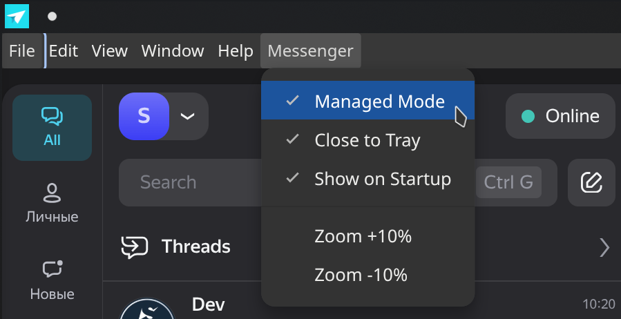

# Yangertron

Yangertron (**YAN**dex messen**GER** elec**TRON**) is an unofficial Yandex 360 Messenger desktop client built with Electron and Vite.

## Project status

Production mode builds and packaged installers are planned for a future release. For now, the project ships only with the developer workflow described below.

## Develop and run locally

The repository assumes a recent Node.js LTS release and `pnpm` are installed on your machine. The `start.sh` helper script takes care of installing dependencies, building the renderer, and launching Electron.

```bash
./start.sh
```

On Linux desktops, the `scripts/linux-install-entity.sh` helper registers a menu entry that launches the app through `start.sh`. The script was authored for KDE Plasma and has been verified there, but it should work on other modern distributions with minor adjustments.

The script reuses the existing Electron install when available and falls back to `steam-run` automatically on NixOS.

## Managed mode

After you authenticate in Yangertron, enable **Managed Mode** from the application menu. Once active, the mode:

- registers the external link handler so every Yandex 360 Messenger link opens in your system browser;
- hides the left navigation rail for a cleaner workspace;
- disables analytics collection inside the embedded workspace.



## Next steps

- Package production-ready builds with `electron-builder` once the application stabilises.
- Publish installers for supported platforms after the production pipeline is in place.
